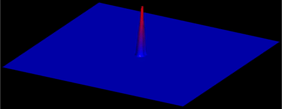

# Gravity wave animation around binary black holes

This demo simulates a scalar wave field on a 2D grid driven by a pair of
orbiting point-mass sources, then writes time-dependent structured-grid data
using the `tecio` Python API for visualization and animation in Tecplot 360.

---

## 1. Physical model

We solve the **scalar wave equation** with a gravitational potential source
term on a uniform 2-D Cartesian domain $\Omega = [-1,1]^2$:

$$
\frac{\partial^2 \phi}{\partial t^2} = c^2 \nabla^2 \phi + S(\mathbf{x}, t)
$$

where $\phi(\mathbf{x},t)$ is the scalar wave field, $c$ is the wave speed,
and $S$ acts as a forcing/constraint derived from the Newtonian potential of
two orbiting masses.

### Gravitational potential

Two point masses $M_1$ and $M_2$ orbit their common centre of mass in a
circular binary with angular frequency $\omega$ and separation radius $r_0$:

$$
x_p(t) = r_0 \sin(2\pi\omega t), \qquad y_p(t) = r_0 \cos(2\pi\omega t)
$$

The combined Newtonian potential seen at grid point $(x, y)$ is

$$
\Phi(x, y, t)
    = \frac{G M_1}{\sqrt{(x_p - x)^2 + (y_p - y)^2}}
    + \frac{G M_2}{\sqrt{(-x_p - x)^2 + (-y_p - y)^2}}
$$

Grid cells where $\Phi > c^2$ are treated as inside the "black-hole"
horizon and are pinned to $-c^2$, mimicking an absorbing interior boundary.

---

## 2. Numerical discretisation

### Spatial grid

The domain is discretised on an $M \times N = 401 \times 401$ uniform grid
with equal spacing in both directions:

$$
\Delta x = \Delta y = \frac{2}{M - 1}
$$

### Time stepping — explicit leap-frog

Three consecutive time levels are stored in `f[:, :, 0:3]` (past, present,
future).  The update rule for interior nodes is the standard second-order
centred finite difference applied to the wave equation:

$$
\phi^{n+1}_{i,j}
    = 2\phi^n_{i,j} - \phi^{n-1}_{i,j}
    + c^2 \frac{\Delta t^2}{\Delta x^2}
      \left(
          \phi^n_{i-1,j} + \phi^n_{i+1,j}
        + \phi^n_{i,j-1} + \phi^n_{i,j+1}
        - 4\phi^n_{i,j}
      \right)
$$

The Courant–Friedrichs–Lewy (CFL) stability condition for a 2-D scalar wave
equation is

$$
\Delta t \leq \frac{\Delta x}{c\sqrt{2}}
$$

The simulation uses $\Delta t = 0.125\,\Delta x / c$, which is safely below
this limit.

### Absorbing boundary layer

Reflections from the domain edges are suppressed by multiplying the entire
field by a spatially varying absorption mask $\alpha(r)$ at every time step:

$$
\alpha(r) =
\begin{cases}
1 & r < 0.8 \\
\dfrac{(0.8)^n}{r^n} & r \geq 0.8
\end{cases}
\quad \text{with } n = 0.045,\ r = \sqrt{x^2 + y^2}
$$

This smoothly damps outgoing waves before they reach the grid boundary.

### Jacobi smoothing

Every `write_interval` steps a single Jacobi iteration is applied to both
the current and previous time levels to suppress high-frequency grid-scale
noise:

$$
\phi^n_{i,j} \leftarrow \tfrac{1}{4}
\left(
    \phi^n_{i-1,j} + \phi^n_{i+1,j}
  + \phi^n_{i,j-1} + \phi^n_{i,j+1}
\right)
$$

---

## 3. Simulation parameters

| Parameter | Symbol | Value |
|-----------|--------|-------|
| Grid size | $M \times N$ | $401 \times 401$ |
| Wave speed | $c$ | $1.0$ |
| Gravitational constant | $G$ | $0.01$ |
| Masses | $M_1, M_2$ | $1.0$ |
| Orbit radius | $r_0$ | $0.025$ |
| Orbit frequency | $\omega$ | $4.0$ |
| Time step | $\Delta t$ | $0.125\,\Delta x / c$ |
| End time | $t_\text{end}$ | $10.0$ |

---

## 4. Writing time-dependent data with `tecio`

The `tecio` library provides a Python context-manager interface for writing
Tecplot SZL (`.szplt`) files.  The file is opened once and each output frame
is appended as a new **ordered (IJK) zone** assigned to a Tecplot *strand*,
which is the mechanism Tecplot uses to animate data over time.

```python
import tecio

with tecio.open("gravity_waves.szplt", "w") as szl:
    ...
```

### Save memory by writing coordinate arrays only once

For the very first output frame (`szl.current_zone == 0`) the
coordinate arrays `X` and `Y` are written alongside the solution field
`phi`, but are shared from zone 1 for all subsequent arrays. This can
be done cleanly from within the zone writing call as:

```python
szl.write_ijk_zone(
    title="Wave Field",
    variables=["x", "y", "phi"],
    data=[X, Y, f[:, :, 2]] if szl.current_zone == 0 else [f[:, :, 2]],
    var_sharing=None if szl.current_zone == 0 else [1, 1, 0],
    strand_id=1,
    solution_time=t,
)
```

Variable sharing avoids storing redundant coordinate data for every time
step — for a 401×401 grid over hundreds of frames this reduces the output
file size significantly.

### Strand and solution time

Setting `strand_id=1` and incrementing `solution_time` tells Tecplot that
all zones belong to the same time-dependent dataset.  Tecplot's animation
engine will then step through the zones in solution-time order, producing a
smooth animation of the evolving wave field.

---

## 5. Animate results with Tecplot

To generate the included animation, run the provided macro in batch mode:

```bash
$ tec360 -b gravity_waves.mcr
```

Final result:


