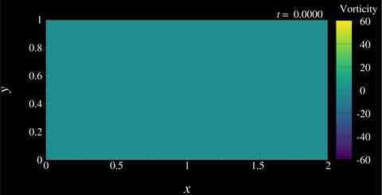

# Spectral 2-D Navier–Stokes solver

This demo solves the incompressible 2-D Navier–Stokes equations on a
periodic rectangular domain using a **pseudo-spectral** method with a
semi-implicit time integrator.  Vorticity snapshots are written at regular
intervals using the `tecio` Python API for animation in Tecplot 360.

---

## 1. Governing equations

The incompressible Navier–Stokes equations in 2-D are

$$
\frac{\partial \mathbf{u}}{\partial t} + (\mathbf{u} \cdot \nabla)\mathbf{u} = -\nabla p + \nu \nabla^2 \mathbf{u} + \mathbf{f}
$$

$$
\nabla \cdot \mathbf{u} = 0
$$

where $\mathbf{u} = (u, v)^T$ is the velocity field, $p$ is the kinematic
pressure (pressure divided by density), $\nu$ is the kinematic viscosity, and
$\mathbf{f}$ is an external body force.  The second equation is the
**incompressibility constraint**, which couples the pressure to the velocity
field.

### Component form

Writing out the two momentum equations explicitly:

$$
\frac{\partial u}{\partial t} = -\left(u \frac{\partial u}{\partial x} + v \frac{\partial u}{\partial y}\right) - \frac{\partial p}{\partial x} + \nu \left(\frac{\partial^2 u}{\partial x^2} + \frac{\partial^2 u}{\partial y^2}\right) + f_x
$$

$$
\frac{\partial v}{\partial t} = -\left(u \frac{\partial v}{\partial x} + v \frac{\partial v}{\partial y}\right) - \frac{\partial p}{\partial y} + \nu \left(\frac{\partial^2 v}{\partial x^2} + \frac{\partial^2 v}{\partial y^2}\right)
$$

### External forcing

A localised Gaussian jet is applied in the $x$-direction, centred at the
midpoint of the domain:

$$
f_x(x, y) = A \exp\!\left(-\alpha\left[(x - x_0)^2 + (y - y_0)^2\right]\right)
$$

with amplitude $A = 40$, concentration $\alpha = 1000$, and centre
$(x_0, y_0) = (1.0,\ 0.5)$.  The sign of the forcing is reversed each half
period, $\text{sgn}(\sin t)$, so the jet alternates direction and
continuously injects vorticity into the domain.

---

## 2. Pseudo-spectral discretisation

### Fourier representation

On a periodic domain of width $L_x$ and height $L_y$, any field $q(x,y)$ can
be represented exactly by its 2-D discrete Fourier transform:

$$
\hat{q}_{mn} = \frac{1}{N_x N_y} \sum_{i=0}^{N_x-1} \sum_{j=0}^{N_y-1} q_{ij}\, e^{-2\pi i (mi/N_x + nj/N_y)}
$$

with corresponding wavenumbers

$$
k_x^m = \frac{2\pi m}{L_x}, \qquad k_y^n = \frac{2\pi n}{L_y}
$$

In spectral space, spatial derivatives become simple multiplications:

$$
\widehat{\frac{\partial q}{\partial x}} = i k_x \hat{q}, \qquad\widehat{\frac{\partial^2 q}{\partial x^2}} = (i k_x)^2 \hat{q} = -k_x^2 \hat{q}
$$

### Spectral Laplacian

The scalar Laplacian in spectral space is therefore

$$
\widehat{\nabla^2 q} = \left[(ik_x)^2 + (ik_y)^2\right]\hat{q} = -\left(k_x^2 + k_y^2\right)\hat{q}
$$

stored in the array `lap` in the code.  The zero-wavenumber mode is set to
$1$ to avoid division by zero; the mean pressure is enforced to zero
separately.

### Nonlinear convection — pseudo-spectral approach

The convective term $(\mathbf{u} \cdot \nabla)\mathbf{u}$ is evaluated in
**divergence form** to conserve momentum:

$$
(\mathbf{u} \cdot \nabla) u = \frac{\partial(uu)}{\partial x} + \frac{\partial(uv)}{\partial y},
\qquad
(\mathbf{u} \cdot \nabla) v = \frac{\partial(uv)}{\partial x} + \frac{\partial(vv)}{\partial y}
$$

In the pseudo-spectral approach, the products $uu$, $uv$, $vv$ are computed
in physical space (where they are just pointwise multiplications) then
transformed back to spectral space, where the derivatives become wavenumber
multiplications:

$$
\widehat{(\mathbf{u} \cdot \nabla) u} = ik_x\,\widehat{uu} + ik_y\,\widehat{uv},
\qquad
\widehat{(\mathbf{u} \cdot \nabla) v} = ik_x\,\widehat{uv} + ik_y\,\widehat{vv}
$$

---

## 3. Time integration — semi-implicit scheme

A fully explicit treatment of the diffusion term $\nu \nabla^2 \mathbf{u}$
would impose a severe parabolic stability constraint
$\Delta t \leq \Delta x^2 / (2\nu)$.  Instead we treat diffusion
**implicitly** and convection **explicitly**, which removes the parabolic
restriction while keeping the nonlinear term cheap to evaluate.

Starting from the momentum equation in spectral space and denoting the
explicit convective and forcing terms collectively as $\hat{R}$, a
first-order implicit–explicit (IMEX) step gives:

$$
\frac{\hat{\mathbf{u}}^{n+1} - \hat{\mathbf{u}}^n}{\Delta t}
= \hat{R}^n + \nu\,\widehat{\nabla^2}\,\hat{\mathbf{u}}^{n+1}
$$

Solving for $\hat{\mathbf{u}}^{n+1}$:

$$
\hat{\mathbf{u}}^{n+1}
= \frac{\hat{\mathbf{u}}^n \left(\tfrac{1}{\Delta t} + \nu\lambda\right) + \hat{R}^n}
       {\tfrac{1}{\Delta t} - \nu\lambda}
$$

where $\lambda = (ik_x)^2 + (ik_y)^2$ is the spectral Laplacian eigenvalue.
This is the update performed in the single line

```python
u_hat = (u_hat*(1/dt + nu*lap[:,:,None]) + f_hat*np.sign(np.sin(t))
         - convect) / (1/dt - nu*lap[:,:,None])
```

### Adaptive CFL time step

The advective time step is limited by the CFL condition

$$
\Delta t = C \frac{\min(\Delta x,\, \Delta y)}{u_{\max}}
$$

with safety factor $C = 0.5$.  A small regularisation $\epsilon = 10^{-8}$ is
added to $u_{\max}$ to handle the zero-velocity initial condition.

---

## 4. Pressure projection

The intermediate velocity field $\hat{\mathbf{u}}^*$ produced by the momentum
update is not yet divergence-free.  The pressure is recovered by taking the
divergence of the momentum equation and invoking $\nabla \cdot \mathbf{u} = 0$:

$$
\nabla^{2} p = \nabla \cdot \mathbf{u}^{*} \quad \Longrightarrow \quad \hat{p} = \frac{i\mathbf{k} \cdot \hat{\mathbf{u}}^{*}}{\lambda} = \frac{ik_x \hat{u}^{*} + ik_y \hat{v}^{*}}{(ik_x)^{2} + (ik_y)^{2}}
$$

The mean pressure $\hat{p}_{00} = 0$ is enforced explicitly.  The velocity is
then corrected by subtracting the spectral pressure gradient:

$$
\hat{\mathbf{u}}^{n+1} = \hat{\mathbf{u}}^* - i\mathbf{k}\,\hat{p}
$$

This is the standard **projection step** that enforces incompressibility.

---

## 5. Vorticity diagnostic

The scalar vorticity $\omega = \partial v/\partial x - \partial u/\partial y$
is the quantity written to file.  In spectral space it is computed without any
finite-difference approximation:

$$
\hat{\omega} = ik_x \hat{v} - ik_y \hat{u}
$$

and then transformed back to physical space via a single inverse FFT.

---

## 6. Simulation parameters

| Parameter | Symbol | Value |
|-----------|--------|-------|
| Domain size | $L_x \times L_y$ | $2.0 \times 1.0$ |
| Grid resolution | $N_x \times N_y$ | $512 \times 256$ |
| Kinematic viscosity | $\nu$ | $9 \times 10^{-4}$ |
| Forcing amplitude | $A$ | $40$ |
| Forcing concentration | $\alpha$ | $1000$ |
| CFL safety factor | $C$ | $0.5$ |
| Output interval | — | $\Delta t_\text{out} = 0.05$ |
| End time | $T$ | $30.0$ |

---

## 7. Writing time-dependent data with `tecio`

The simulation outputs a vorticity snapshot every `write_interval` steps.
The file is opened once and each snapshot is appended as a new zone.

```python
import tecio

with tecio.open("simple_spectral.szplt", "w") as szl:
    ...
```

### Save memory by writing coordinate arrays only once

For the very first output frame (`szl.current_zone == 0`) the
coordinate arrays `X` and `Y` are written alongside the solution field
`phi`, but are shared from zone 1 for all subsequent arrays. This can
be done cleanly from within the zone writing call as:


```python
szl.write_ijk_zone(
    title="Vorticity Field",
    variables=["x", "y", "omega"],
    data=[X, Y, vorticity] if szl.current_zone==0 else [vorticity],
    var_sharing=None if szl.current_zone==0 else [1, 1, 0]
    strand_id=1,
    solution_time=t,
)
```

All three arrays have shape `(N_x, N_y)`, matching the `(I, J)` dimensions of
the structured grid.

Because the grid is fixed, every later snapshot shares the coordinate
variables from zone 1 and supplies only the updated vorticity array.  The
`var_sharing` list maps each variable slot to the 1-based zone index it
should be copied from; a value of `0` means the variable is supplied
directly:

For a $512 \times 256$ grid saved at 600 output times, sharing the coordinate
arrays avoids writing roughly $600 \times 2 \times 512 \times 256 \times 8$
bytes $\approx 1.2\ \text{GB}$ of redundant data.

---

## 8. Animate results with Tecplot

To generate the included animation, run the provided macro in batch mode:

```bash
$ tec360 -b simple_spectral.mcr
```

Final result:


