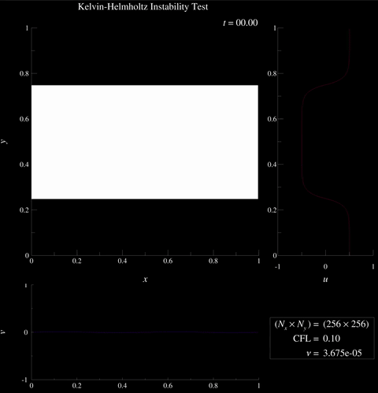
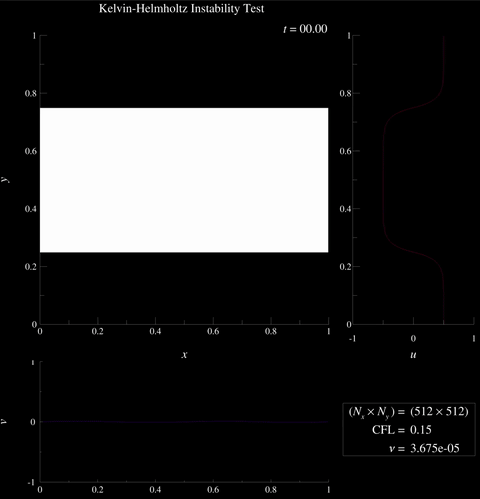
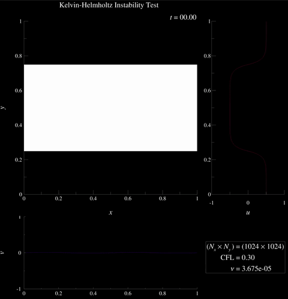

# Spectral 2-D Navier–Stokes solver — Kelvin–Helmholtz Instability

This demo solves the incompressible 2-D Navier–Stokes equations on a
periodic rectangular domain using a **pseudo-spectral** method with a
semi-implicit time integrator.  The simulation is initialised with the
smooth shear-layer profile proposed by McNally, Lyra & Passy (2012) as a
well-posed benchmark for the Kelvin–Helmholtz instability (KHI).  Vorticity
snapshots are written at regular intervals using the `tecio` Python API for
animation in Tecplot 360.

---

## 1. Governing equations

The incompressible Navier–Stokes equations in 2-D are

$$
\frac{\partial u_i}{\partial t} + \frac{\partial (u_i u_j)}{\partial x_j} = -\frac{\partial p}{\partial x_i} + \nu \frac{\partial^2 u_i}{\partial x_j \partial x_j} + f_i
$$

$$
\frac{\partial u_j}{\partial x_j} = 0
$$

where $u_i = (u, v)^T$ is the velocity vector, $p$ is kinematic pressure
(pressure divided by density), $\nu$ is kinematic viscosity, and $f_i$ is an
optional external body force.

The convective term is written in **divergence form**
$\partial(u_i u_j)/\partial x_j$ rather than advective form
$u_j \partial u_i/\partial x_j$.  The two are equivalent under
incompressibility:

$$
\frac{\partial (u_i u_j)}{\partial x_j} = u_j \frac{\partial u_i}{\partial x_j} + u_i \underbrace{\frac{\partial u_j}{\partial x_j}}_{=\,0} = u_j \frac{\partial u_i}{\partial x_j}
$$

The divergence form is preferred here because the products $u_i u_j$ can be
computed directly in physical space and then transformed to spectral space
(see Section 2).

The incompressibility constraint couples the pressure to the velocity through
a Poisson equation obtained by taking the divergence of the momentum equation:

$$
\frac{\partial^2 p}{\partial x_i \partial x_i} = -\frac{\partial^2 (u_i u_j)}{\partial x_i \partial x_j}
$$

After each momentum update the velocity is projected onto the divergence-free
subspace by subtracting the pressure gradient:

$$
u_i \leftarrow u_i - \frac{\partial p}{\partial x_i}
$$

### Component form

Writing out both momentum equations explicitly with the body force retained
(used in the alternating-jet variant of this script):

$$
\frac{\partial u}{\partial t} = -\frac{\partial (uu)}{\partial x} - \frac{\partial (uv)}{\partial y} - \frac{\partial p}{\partial x} + \nu \left(\frac{\partial^2 u}{\partial x^2} + \frac{\partial^2 u}{\partial y^2}\right) + f_x
$$

$$
\frac{\partial v}{\partial t} = -\frac{\partial (uv)}{\partial x} - \frac{\partial (vv)}{\partial y} - \frac{\partial p}{\partial y} + \nu \left(\frac{\partial^2 v}{\partial x^2} + \frac{\partial^2 v}{\partial y^2}\right) + f_y
$$

---

## 2. Pseudo-spectral discretisation

### Fourier representation

On a periodic domain of width $L_x$ and height $L_y$, any field $q(x,y)$ can
be represented by its 2-D discrete Fourier transform:

$$
\hat{q}_{mn} = \frac{1}{N_x N_y} \sum_{i=0}^{N_x-1} \sum_{j=0}^{N_y-1}
               q_{ij}\, e^{-2\pi \mathrm{i} (mi/N_x + nj/N_y)}
$$

with corresponding wavenumbers

$$
k_x^m = \frac{2\pi m}{L_x}, \qquad k_y^n = \frac{2\pi n}{L_y}
$$

In spectral space, spatial derivatives become algebraic multiplications:

$$
\widehat{\frac{\partial q}{\partial x_j}} = \mathrm{i} k_j \hat{q},
\qquad
\widehat{\frac{\partial^2 q}{\partial x_j \partial x_j}} = -k_j^2 \hat{q}
$$

### Spectral Laplacian

The scalar Laplacian in spectral space is therefore

$$
\widehat{\nabla^2 q} = \left[(\mathrm{i}k_x)^2 + (\mathrm{i}k_y)^2\right]\hat{q} = -\left(k_x^2 + k_y^2\right)\hat{q} \equiv \lambda \hat{q}
$$

stored in the array `lap` in the code ($\lambda \leq 0$).  The
zero-wavenumber mode is set to $1$ to avoid division by zero; the mean
pressure is enforced separately.

### Nonlinear convection — pseudo-spectral approach

The convective fluxes $u_i u_j$ are computed in physical space (pointwise
multiplications) and then transformed to spectral space, where the outer
derivative becomes a wavenumber multiplication:

$$
\widehat{\frac{\partial (u\,u)}{\partial x}}  = \mathrm{i}k_x\,\widehat{uu}, \quad
\widehat{\frac{\partial (u\,v)}{\partial y}}  = \mathrm{i}k_y\,\widehat{uv}, \quad
\widehat{\frac{\partial (u\,v)}{\partial x}}  = \mathrm{i}k_x\,\widehat{uv}, \quad
\widehat{\frac{\partial (v\,v)}{\partial y}}  = \mathrm{i}k_y\,\widehat{vv}
$$

giving the spectral convective terms for each momentum equation:

$$
\widehat{(u \cdot \nabla)u} = \mathrm{i}k_x\,\widehat{uu} + \mathrm{i}k_y\,\widehat{uv},
\qquad
\widehat{(u \cdot \nabla)v} = \mathrm{i}k_x\,\widehat{uv} + \mathrm{i}k_y\,\widehat{vv}
$$

---

## 3. Time integration — IMEX semi-implicit scheme

Convection and forcing are treated **explicitly** (forward Euler) while
diffusion is treated **implicitly** with a Crank–Nicolson average, averaging
the diffusion operator between levels $n$ and $n{+}1$.  This avoids the
parabolic stability constraint $\Delta t \leq \Delta x^2/(2\nu)$ while
keeping the nonlinear term cheap to evaluate.  The semi-discrete equations in
spectral space are:

$$
\frac{\hat{u}^{\,n+1} - \hat{u}^{\,n}}{\Delta t} = -\Bigl(\mathrm{i}k_x\,\widehat{uu}^{\,n} + \mathrm{i}k_y\,\widehat{uv}^{\,n}\Bigr) + \nu\lambda\bigl(\hat{u}^{\,n+1} + \hat{u}^{\,n}\bigr) + \hat{f}_x^{\,n}
$$

$$
\frac{\hat{v}^{\,n+1} - \hat{v}^{\,n}}{\Delta t} = -\Bigl(\mathrm{i}k_x\,\widehat{uv}^{\,n} + \mathrm{i}k_y\,\widehat{vv}^{\,n}\Bigr) + \nu\lambda\bigl(\hat{v}^{\,n+1} + \hat{v}^{\,n}\bigr) + \hat{f}_y^{\,n}
$$

where $\lambda = (\mathrm{i}k_x)^2 + (\mathrm{i}k_y)^2 \leq 0$ is the
spectral Laplacian eigenvalue.  Collecting $\hat{u}^{\,n+1}$ on the left and
solving gives the explicit update rules:

$$
\boxed{
\hat{u}^{\,n+1}
= \frac{\hat{u}^{\,n}\!\left(\dfrac{1}{\Delta t} + \nu\lambda\right)
        - \Bigl(\mathrm{i}k_x\,\widehat{uu}^{\,n} + \mathrm{i}k_y\,\widehat{uv}^{\,n}\Bigr)
        + \hat{f}_x^{\,n}}
       {\dfrac{1}{\Delta t} - \nu\lambda}
}
\qquad
\boxed{
\hat{v}^{\,n+1}
= \frac{\hat{v}^{\,n}\!\left(\dfrac{1}{\Delta t} + \nu\lambda\right)
        - \Bigl(\mathrm{i}k_x\,\widehat{uv}^{\,n} + \mathrm{i}k_y\,\widehat{vv}^{\,n}\Bigr)
        + \hat{f}_y^{\,n}}
       {\dfrac{1}{\Delta t} - \nu\lambda}
}
$$

Because $\lambda \leq 0$ the denominator is strictly positive for all
wavenumbers, giving unconditional stability for the diffusive modes.
In code (with forcing absent for the KHI case):

```python
u_hat = (u_hat * (1/dt + nu_lap) - conv_u + fx) / (1/dt - nu_lap)
v_hat = (v_hat * (1/dt + nu_lap) - conv_v + fy) / (1/dt - nu_lap)
```

### Adaptive CFL time step

The time step is set by the advective CFL condition:

$$
\Delta t = C_\text{CFL} \frac{\min(\Delta x,\, \Delta y)}{|\mathbf{u}|_{\max}}
$$

with a small regularisation $\varepsilon = 10^{-8}$ added to $|\mathbf{u}|_{\max}$
to handle the zero-velocity initial condition.

---

## 4. Pressure projection

The velocity field $\hat{u}_i^*$ produced by the momentum update is not yet
divergence-free.  Taking the divergence of the momentum equation and invoking
the incompressibility constraint $\partial u_j^{n+1}/\partial x_j = 0$
gives the Poisson equation for pressure in spectral space:

$$
\lambda\,\hat{p} = \mathrm{i}k_j\,\hat{u}_j^*
\quad\Longrightarrow\quad
\hat{p} = \frac{\mathrm{i}k_x\,\hat{u}^* + \mathrm{i}k_y\,\hat{v}^*}{\lambda}
$$

The mean pressure $\hat{p}_{00} = 0$ is enforced explicitly.  The velocity is
then corrected by subtracting the spectral pressure gradient:

$$
\hat{u}_i^{\,n+1} = \hat{u}_i^* - \mathrm{i}k_i\,\hat{p}
$$

This standard **projection step** enforces incompressibility at each time
level.

---

## 5. Vorticity diagnostic

The scalar vorticity $\omega = \partial v/\partial x - \partial u/\partial y$
is computed without any finite-difference approximation:

$$
\hat{\omega} = \mathrm{i}k_x\,\hat{v} - \mathrm{i}k_y\,\hat{u}
$$

and recovered in physical space via a single inverse FFT.

---

## 6. Kelvin–Helmholtz initial conditions

The KHI initial condition follows the smooth shear-layer profile of
**McNally, Lyra & Passy (2012)** (ApJS 201, 18), which is designed to be
well-posed and support convergent simulations.  A piecewise-exponential
profile is used to approximate a hyperbolic-tangent shear layer while
remaining periodic on the unit square $[0,1]^2$:

$$
u(y) = \begin{cases}
U_1 - \dfrac{U_1 - U_2}{2}\exp\left(\dfrac{y - 1/4}{L}\right) & \text{if} \ \ 0 \leq y < 1/4 \\
U_2 + \dfrac{U_1 - U_2}{2}\exp\left(\dfrac{1/4 - y}{L}\right) & \text{if} \ \ 1/4 \leq y < 1/2 \\
U_2 + \dfrac{U_1 - U_2}{2}\exp\left(\dfrac{y - 3/4}{L}\right) & \text{if} \ \ 1/2 \leq y < 3/4 \\
U_1 - \dfrac{U_1 - U_2}{2}\exp\left(\dfrac{3/4 - y}{L}\right) & \text{if} \ \ 3/4 \leq y \leq 1
\end{cases}
$$

with $U_1 = 0.5$, $U_2 = -0.5$, and layer thickness $L = 0.025$.  Two
counter-flowing shear layers are present (at $y = 1/4$ and $y = 3/4$),
consistent with the periodic domain.  A small sinusoidal perturbation seeds
the instability:

$$
v(x, y) = 0.01 \sin(4\pi x)
$$

A passive tracer $\phi$ is initialised to $1$ in the inner jet region
($1/4 \leq y < 3/4$) and $0$ in the outer streams, approximating a colour dye
placed in the fluid to trace the density interface typically visualised in KHI
problems.  The tracer satisfies the pure advection equation:

$$
\frac{\partial \phi}{\partial t} + u_j \frac{\partial \phi}{\partial x_j} = 0
$$

which is solved by semi-Lagrangian advection — each grid point is traced
backward one step along the velocity field and $\phi$ is interpolated there:

```python
ix = (X - u * dt_out) / dx % nx
iy = (Y - v * dt_out) / dy % ny

phi = map_coordinates(phi, [ix.ravel(), iy.ravel()],
                      order=1, mode='wrap').reshape(nx, ny)
```

The key motivation for this smooth profile is that a sharp (discontinuous)
shear layer does not converge with grid refinement — numerical noise seeds
structure at all scales.  With the smooth exponential profile, the dominant
instability mode is set by the physical shear-layer thickness $L$ rather than
the grid spacing.

---

## 7. Simulation parameters

| Parameter | Symbol | Value |
|-----------|--------|-------|
| Domain size | $L_x \times L_y$ | $1.0 \times 1.0$ |
| Kinematic viscosity | $\nu$ | $3.675 \times 10^{-5}$ |
| Background velocities | $U_1,\,U_2$ | $+0.5,\,-0.5$ |
| Shear-layer thickness | $L$ | $0.025$ |
| Perturbation amplitude | — | $0.01$ |
| Output interval | — | $\Delta t_\text{out} = 0.01$ |
| End time | $T$ | $15.0$ |

### Resolution-dependent CFL factors

Balancing instability growth against numerical stability required adjusting
the CFL factor with resolution (see Section 8):

| Grid | $N_x \times N_y$ | CFL |
|------|-----------------|-----|
| Low | $256 \times 256$ | $0.10$ |
| Medium | $512 \times 512$ | $0.15$ |
| High | $1024 \times 1024$ | $0.30$ |

---

## 8. Resolution effects and numerical stability

### Balancing physical instability against diffusion

For the KHI to develop and roll up into billows, the viscous damping time
must be long compared to the instability growth time.  The characteristic
linear growth rate scales as $\sigma \sim U_1/(2L)$, while viscosity damps
structures of scale $\ell$ over a time $\tau_\nu \sim \ell^2/\nu$.  A lower
viscosity promotes instability growth but reduces the effective resolution
of the flow, increasing the risk of aliasing and spectral blocking at the
grid scale.

The value $\nu = 3.675 \times 10^{-5}$ was chosen as a compromise: low enough
that the KHI billows grow and roll up before diffusion damps the shear layer,
but large enough to damp energy accumulating at high wavenumbers and prevent
the simulation from blowing up.

### CFL and the semi-implicit time step

Because the diffusion term is treated implicitly, the time step is constrained
only by the advective CFL condition.  However, at high resolution the spectral
method resolves shorter wavelengths whose phase errors accumulate more rapidly.
A more conservative CFL is therefore required at low resolution to prevent the
explicit convection scheme from becoming unstable — counter-intuitively, the
coarser grids use the *smaller* CFL.  At high resolution the flow is smoother
(diffusion is more effective relative to the grid scale) and a larger CFL is
stable.

### Grid-scale instabilities at low resolution

At $256 \times 256$ the spectral resolution is marginal for the chosen
parameters.  Odd–even, grid-point-to-grid-point oscillations appear in the
vorticity field — a classic spectral aliasing artefact.  Because the
pseudo-spectral method computes nonlinear products in physical space and
then transforms back, the quadratic terms fold energy from wavenumbers above
the Nyquist limit back into the resolved range.  When viscous dissipation is
insufficient to drain this aliased energy, it accumulates at the grid scale
and manifests as the characteristic "salt-and-pepper" noise visible in the
low-resolution animations.  Increasing the grid to $512 \times 512$ or
$1024 \times 1024$ substantially suppresses this artefact: the additional
resolved modes push the aliasing to higher wavenumbers where viscosity is
more effective.

---

## 9. Writing time-dependent data with `tecio`

The simulation outputs a flow-field snapshot every `WRITE_INTERVAL` steps.
The file is opened once and each snapshot is appended as a new zone.  Dataset-level
auxiliary data is written once at the start to record simulation parameters and
hint Tecplot which variables to use for axes and velocity components:

```python
with tecio.open("simple_spectral2.szplt", "w") as szl:
    szl.add_auxdataset_dict({
        "Common.XVar": 1,
        "Common.YVar": 2,
        "Common.UVar": 3,
        "Common.VVar": 4,
        "Common.CVar": 9,
        "Nx": nx,
        "Ny": ny,
        "CFL": cfl,
        "Viscosity": nu,
        "U1": U1,
        "U2": U2,
        "L": L,
    })
```

The `Common.*` keys are recognised by Tecplot 360 and automatically configure
the spatial axes and velocity vectors on load. `Common.CVar` sets the default
contour variable on load, here setitng to the variable number containing the
flow tracer. The remaining keys are available as scalars for use in dynamic
text or equations

### Save memory by writing coordinate arrays only once

For the very first output frame (`szl.current_zone == 0`) the coordinate
arrays `X` and `Y` are written alongside the solution fields.  All
subsequent zones share those arrays from zone 1 and supply only the
updated solution data:

```python
szl.write_ijk_zone(
    title=f"Flow Field Step {k}",
    variables=["x", "y", "uvel", "vvel", "pres", "vort", "div", "qcrit", "tracer"],
    data=[X, Y, *flow] if szl.current_zone == 0 else flow,
    var_sharing=None if szl.current_zone == 0 else [1, 1] + [0] * len(flow),
    strand_id=1,
    solution_time=t,
    aux={"dt": dt, "SubIterCount": count},
)
```

The `var_sharing` list maps each variable slot to the 1-based zone index it
should be copied from; a value of `0` means the variable is supplied
directly.  For a $1024 \times 1024$ grid saved at 150 output times, sharing
the coordinate arrays avoids writing roughly
$150 \times 2 \times 1024^2 \times 4\ \text{bytes} \approx 1.3\ \text{GB}$
of redundant data.

---

## 10. Animate results with Tecplot

To generate the animation from the `.szplt` output, run the provided macro in
batch mode:

```bash
$ tec360 -b simple_spectral.mcr
```

Results at three resolutions — note the progressive suppression of grid-scale
noise and the increasingly well-defined vortex cores as resolution increases:





---

## References

McNally, C. P., Lyra, W., & Passy, J.-C. (2012).
*A Well-posed Kelvin–Helmholtz Instability Test and Comparison.*
ApJS, 201, 18.
[doi:10.1088/0067-0049/201/2/18](https://doi.org/10.1088/0067-0049/201/2/18)
