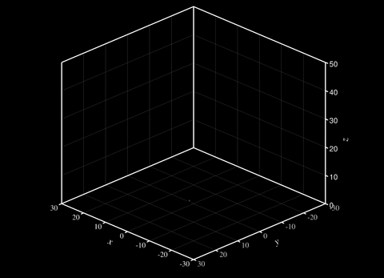

# Lorenz attractor animation

This demo generates a Lorenz attractor using classical RK4 numerical
integration, then writes both a static reference trajectory and a
time-dependent animated dataset using the `tecio` Python API for
visualization in Tecplot 360.

---

## 1. The Lorenz system

The **Lorenz system** is a set of three coupled, nonlinear ordinary
differential equations that exhibit sensitive dependence on initial
conditions — a hallmark of deterministic chaos.

The equations are:

$$
\frac{dx}{dt} = \sigma (y - x)
$$

$$
\frac{dy}{dt} = x(\rho - z) - y
$$

$$
\frac{dz}{dt} = xy - \beta z
$$

where the three parameters control the character of the flow:

| Parameter | Symbol | Value | Physical meaning |
|-----------|--------|-------|-----------------|
| Prandtl number | $\sigma$ | $10$ | Ratio of momentum to thermal diffusivity |
| Rayleigh number | $\rho$ | $28$ | Normalised temperature difference driving convection |
| Geometric factor | $\beta$ | $8/3$ | Aspect ratio of the convection rolls |

At these classical values the system exhibits chaotic behaviour, and
trajectories converge onto the iconic two-lobed **strange attractor** with
fractal dimension $\approx 2.06$.

```python
import numpy as np

sigma = 10.0
beta = 8.0 / 3.0
rho = 28.0


def lorenz(state):
    x, y, z = state
    dx = sigma * (y - x)
    dy = x * (rho - z) - y
    dz = x * y - beta * z
    return np.array([dx, dy, dz])
```

---

## 2. Numerical integration — classical RK4

We integrate the system using the classical **fourth-order Runge–Kutta**
method.  Given the state vector $\mathbf{u}^n = (x, y, z)^T$ at time $t_n$,
the update to $t_{n+1} = t_n + \Delta t$ is

$$
\mathbf{u}^{n+1}
    = \mathbf{u}^n
    + \frac{\Delta t}{6}\left(\mathbf{k}_1 + 2\mathbf{k}_2 + 2\mathbf{k}_3 + \mathbf{k}_4\right)
$$

where the four stage derivatives are

$$
\begin{aligned}
\mathbf{k}_1 &= f\!\left(\mathbf{u}^n\right) \\
\mathbf{k}_2 &= f\!\left(\mathbf{u}^n + \tfrac{\Delta t}{2}\,\mathbf{k}_1\right) \\
\mathbf{k}_3 &= f\!\left(\mathbf{u}^n + \tfrac{\Delta t}{2}\,\mathbf{k}_2\right) \\
\mathbf{k}_4 &= f\!\left(\mathbf{u}^n + \Delta t\,\mathbf{k}_3\right)
\end{aligned}
$$

and $f(\mathbf{u})$ is the right-hand side of the Lorenz system above.

RK4 has a local truncation error of $\mathcal{O}(\Delta t^5)$ and a global
error of $\mathcal{O}(\Delta t^4)$, making it an excellent balance of
accuracy and cost for smooth ODE systems.  The simulation uses
$\Delta t = 0.01$ over $5000$ steps, giving a total integration time of
$T = 50$.

```python
dt = 0.01
n_steps = 5000

traj = np.zeros((n_steps, 3))
state = np.array([1.0, 1.0, 1.0])

for i in range(n_steps):
    traj[i] = state

    k1 = lorenz(state)
    k2 = lorenz(state + 0.5 * dt * k1)
    k3 = lorenz(state + 0.5 * dt * k2)
    k4 = lorenz(state + dt * k3)

    state = state + (dt / 6.0) * (k1 + 2 * k2 + 2 * k3 + k4)
```

The full trajectory is stored row-wise in `traj` and then split into
coordinate arrays:

```python
x = traj[:, 0]
y = traj[:, 1]
z = traj[:, 2]
```

---

## 3. Additional variables — $t$ and $\tau$

Two scalar variables are written alongside the spatial coordinates:

- **$t$** — the absolute simulation time at each point along the trajectory,
  $t_i = i \,\Delta t$.  For the growing-trajectory animation this allows
  Tecplot to colour the curve by age.

- **$\tau$** — the time *relative to the current frame*, defined as
  $\tau_i = (i - i_\text{frame}) \,\Delta t \leq 0$.  This gives every point
  a value of zero at the head of the curve and increasingly negative values
  further back along the tail, which is useful for applying a fade effect in
  the colour map.

For the static reference zone and the moving particle, $t$ and $\tau$ are
declared **passive** — they occupy a slot in the variable list but no data is
stored or written for them, saving memory and file space.

---

## 4. Writing time-dependent data with `tecio`

The `tecio` library exposes a Python context-manager interface for writing
Tecplot SZL (`.szplt`) files.  All zones are appended to a single open file
handle within the `with` block.

```python
import tecio

with tecio.open("lorenz.szplt", "w") as szl:
    ...
```

### Static reference zone (strand 0)

The complete attractor is written as a single ordered (IJK) line zone with
$I = N_\text{steps}$, $J = K = 1$.  Setting `strand_id=0` marks it as a
static zone that is always visible regardless of the current animation time.
Variables `t` and `tau` are declared passive so no data array needs to be
supplied for them:

```python
szl.write_ijk_zone(
    title="Lorenz Attractor",
    variables=["x", "y", "z", "t", "tau"],
    data=[x, y, z],
    passive_vars=[False, False, False, True, True],
    strand_id=0,
)
```

### Growing trajectory (strand 1)

Each frame writes the trajectory from the start up to step $i$, so the curve
grows as the animation advances.  The zone at frame $i$ contains $i + 1$
points, giving it dimensions $(i+1, 1, 1)$:

```python
for i in range(0, n_steps, 10):
    szl.write_ijk_zone(
        title="Trajectory",
        variables=["x", "y", "z", "t", "tau"],
        data=[
            x[: i + 1],
            y[: i + 1],
            z[: i + 1],
            np.arange(i + 1) * dt,  # t  = absolute time
            (np.arange(i + 1) - i - 1) * dt,  # tau = time relative to head
        ],
        strand_id=1,
        solution_time=i * dt,
    )
```

Assigning `strand_id=1` and a monotonically increasing `solution_time` tells
Tecplot that all these zones form a single time-evolving object.  The
animation engine steps through them in solution-time order.

### Moving particle (strand 2)

A second strand contains only the single point at step $i$, creating a
marker that travels along the attractor in lockstep with the growing curve.
Again `t` and `tau` are passive since a single-point zone makes relative
time meaningless:

```python
for i in range(0, n_steps, 10):
    szl.write_ijk_zone(
        title="Particle",
        variables=["x", "y", "z", "t", "tau"],
        data=[x[i : i + 1], y[i : i + 1], z[i : i + 1]],
        passive_vars=[False, False, False, True, True],
        strand_id=2,
        solution_time=i * dt,
    )
```

Because strands 1 and 2 share the same `solution_time` values, Tecplot
advances both simultaneously during playback, keeping the particle exactly at
the head of the growing curve.

---

## 5. Create the animation with Tecplot

To generate the included animation, run the provided macro in batch mode:

```bash
$ tec360 -b lorenz.mcr
```

Final result:


